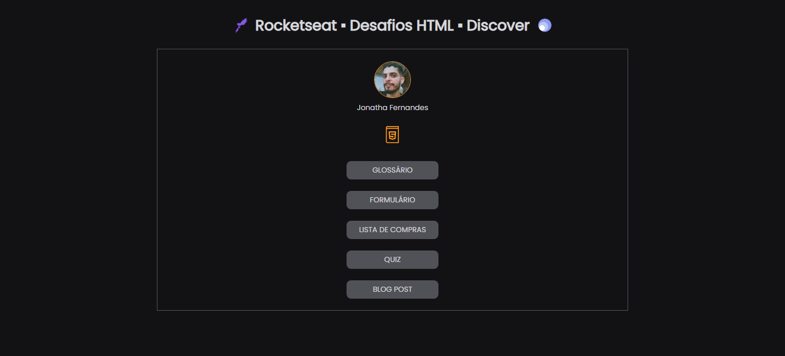

<h1 align="center"> Desafios HTML </h1>

Página de agrupamento de links com desafios de HTML.
 

  <a href="#-tecnologias">Tecnologias</a>&nbsp;&nbsp;&nbsp;|&nbsp;&nbsp;&nbsp;
  <a href="#-projeto">Projeto</a>&nbsp;&nbsp;&nbsp;&nbsp;&nbsp;&nbsp;

 

  

## 🚀 Tecnologias

Esse projeto foi desenvolvido com as seguintes tecnologias:

- HTML e CSS
- Git e Github

## 💻 Projeto

Página de agrupamento de links com desafios de HTML proposto pela Rocketseat através do curso<a href="https://www.rocketseat.com.br/discover">Discover.</a>

## 🖱️ Visite

https://jonathafernandes.github.io/desafios-html/index.html

---
👨‍💻 Desenvolvedor
 
- Jonatha Fernandes
